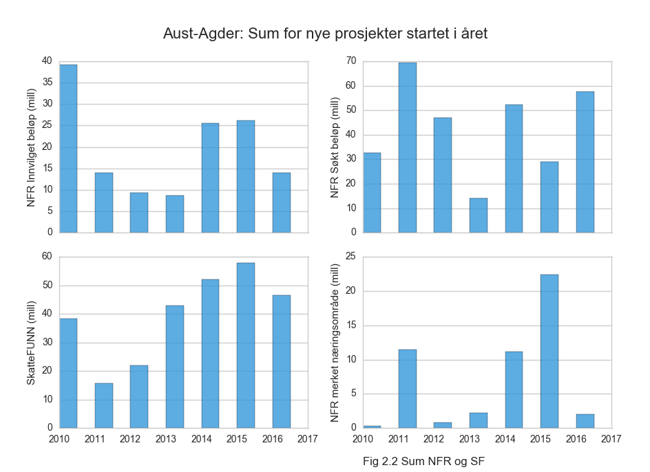
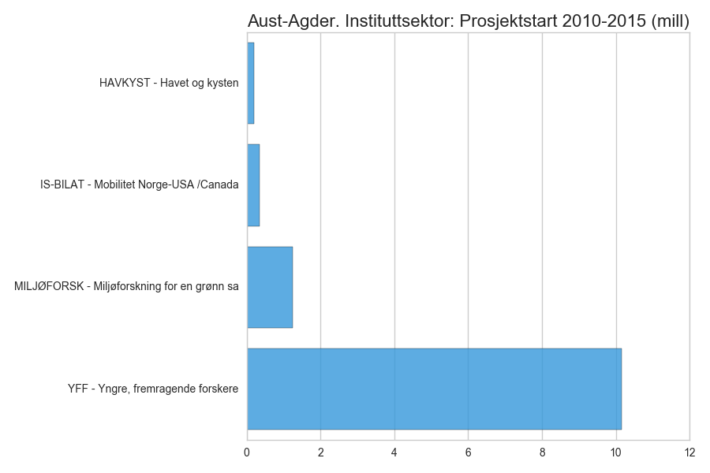
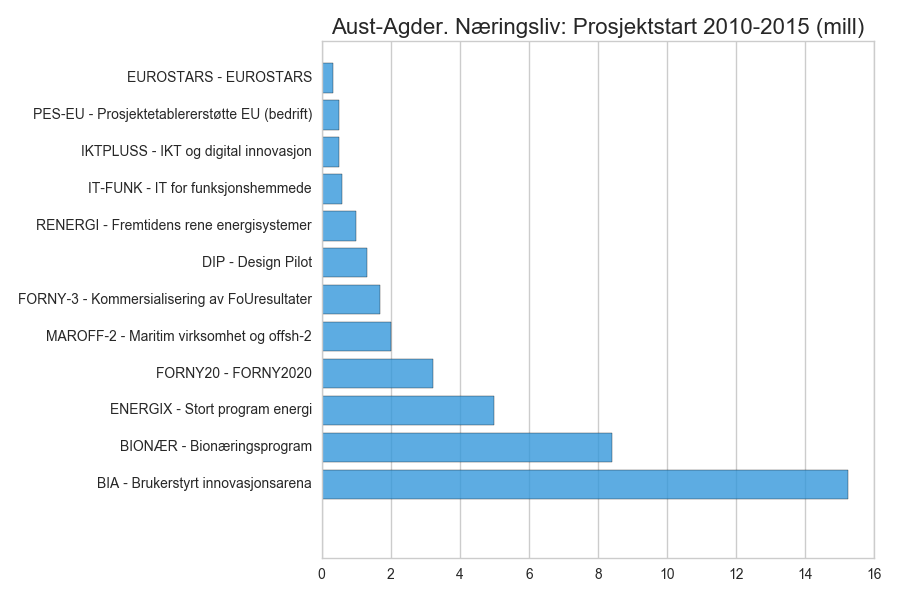
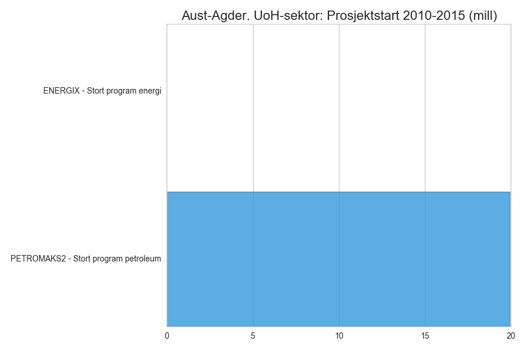
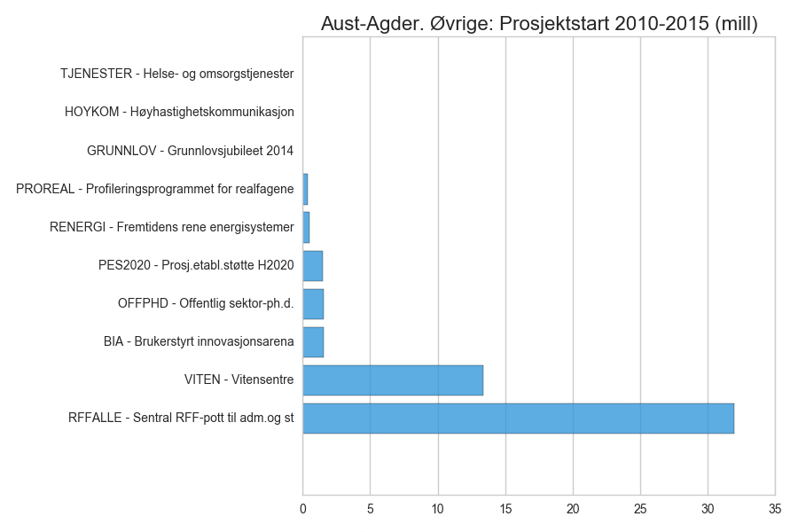
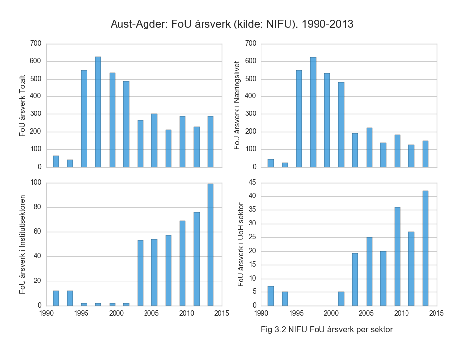

# Aust-Agder

Tips: Klikk på figur for å åpne i full størrelse

<a href="https://raw.githubusercontent.com/samspill/regionalt/master/Fylker/Aust-Agder/Aust-Agder Næringsområder (merking) Andel i prosent av sum merket beløp for alle NFR prosjekter startet i året (heatmap).png"> Andel i prosent av sum merket beløp for alle NFR prosjekter startet i året (heatmap).png)</a>

<a href="https://raw.githubusercontent.com/samspill/regionalt/master/Fylker/Aust-Agder/Aust-Agder Næringsområder (merking) Andel i prosent av sum merket beløp for alle NFR prosjekter startet i året (linjer).png"> Andel i prosent av sum merket beløp for alle NFR prosjekter startet i året (linjer).png)</a>

<a href="https://raw.githubusercontent.com/samspill/regionalt/master/Fylker/Aust-Agder/Aust-Agder Fylkets andel av totalt omsøkt skattefradrag i godkjente nye prosjekter startet i året (heatmap).png">.png)</a>

<a href="https://raw.githubusercontent.com/samspill/regionalt/master/Fylker/Aust-Agder/Aust-Agder Fylkets andel av totalt omsøkt skattefradrag i godkjente nye prosjekter startet i året (linjer).png">.png)</a>

<a href="https://raw.githubusercontent.com/samspill/regionalt/master/Fylker/Aust-Agder/Aust-Agder NFR og SF andel av totalt omsøkt eller innvilget beløp for nye prosjekter startet i året (heatmap).png">.png)</a>

<a href="https://raw.githubusercontent.com/samspill/regionalt/master/Fylker/Aust-Agder/Aust-Agder NFR og SF andel av totalt omsøkt eller innvilget beløp for nye prosjekter startet i året (linjer).png">.png)</a>

<a href="https://raw.githubusercontent.com/samspill/regionalt/master/Fylker/Aust-Agder/Aust-Agder NIFU FoU Årsverk og Beløp per Sektor (heatmap).png">.png)</a>

<a href="https://raw.githubusercontent.com/samspill/regionalt/master/Fylker/Aust-Agder/Aust-Agder NIFU FoU Årsverk og Beløp per Sektor (linjer).png">.png)</a>

<a href="https://raw.githubusercontent.com/samspill/regionalt/master/Fylker/Aust-Agder/Aust-Agder NIFU FoU Statistikk Prosentandel av total for hele landet (heatmap).png">.png)</a>

<a href="https://raw.githubusercontent.com/samspill/regionalt/master/Fylker/Aust-Agder/Aust-Agder NIFU FoU Statistikk Prosentandel av total for hele landet (linjer).png">.png)</a>

<a href="https://raw.githubusercontent.com/samspill/regionalt/master/Fylker/Aust-Agder/Aust-Agder Andel av totalt antall sysselsatte i næringen som jobber i fylket (heatmap).png">.png)</a>

<a href="https://raw.githubusercontent.com/samspill/regionalt/master/Fylker/Aust-Agder/Aust-Agder Andel av totalt antall sysselsatte i næringen som jobber i fylket (linjer).png">.png)</a>

<a href="https://raw.githubusercontent.com/samspill/regionalt/master/Fylker/Aust-Agder/Aust-Agder Bruttoprodukt (milliarder) (heatmap).png"> (heatmap).png)</a>

<a href="https://raw.githubusercontent.com/samspill/regionalt/master/Fylker/Aust-Agder/Aust-Agder Bruttoprodukt (milliarder) (linjer).png"> (linjer).png)</a>

<a href="https://raw.githubusercontent.com/samspill/regionalt/master/Fylker/Aust-Agder/BIA Innvilget første halvår til aktive prosjekter (heatmap).png">.png)</a>

<a href="https://raw.githubusercontent.com/samspill/regionalt/master/Fylker/Aust-Agder/BIA Innvilget første halvår til aktive prosjekter (linjer).png">.png)</a>

<a href="https://raw.githubusercontent.com/samspill/regionalt/master/Fylker/Aust-Agder/Aust-Agder Bruttoprodukt per sysselsatt (1000 kr) (heatmap).png"> (heatmap).png)</a>

<a href="https://raw.githubusercontent.com/samspill/regionalt/master/Fylker/Aust-Agder/Aust-Agder Bruttoprodukt per sysselsatt (1000 kr) (linjer).png"> (linjer).png)</a>

<a href="https://raw.githubusercontent.com/samspill/regionalt/master/Fylker/Aust-Agder/Aust-Agder Sysselsatte fordelt på fagfelt (heatmap).png">.png)</a>

<a href="https://raw.githubusercontent.com/samspill/regionalt/master/Fylker/Aust-Agder/Aust-Agder Sysselsatte fordelt på utdanningsnivå (heatmap).png">.png)</a>

<a href="https://raw.githubusercontent.com/samspill/regionalt/master/Fylker/Aust-Agder/Aust-Agder Sysselsatte fordelt på utdanningsnivå (linjer).png">.png)</a>

