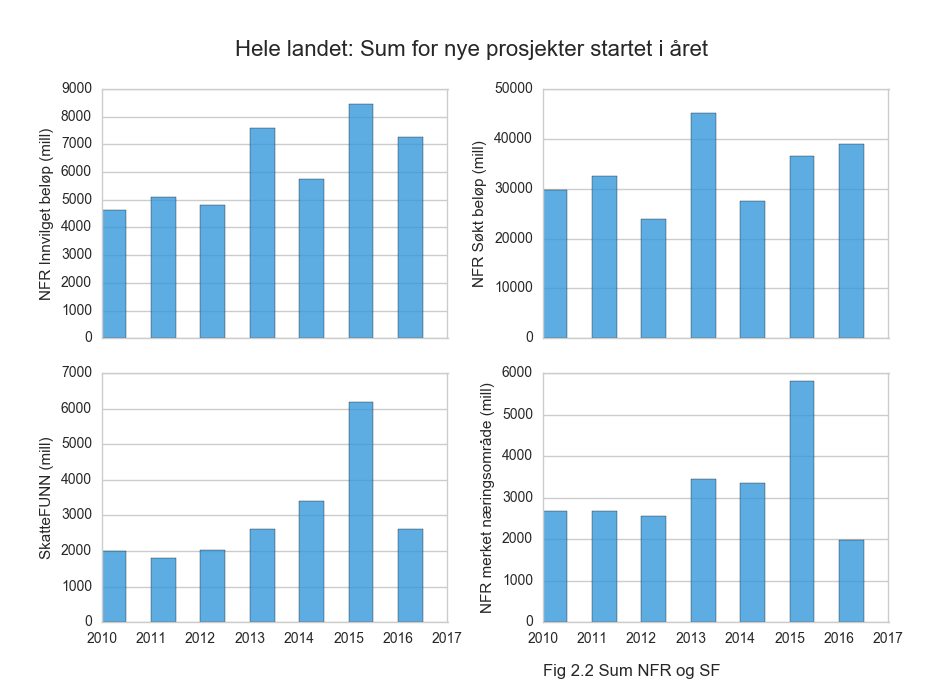
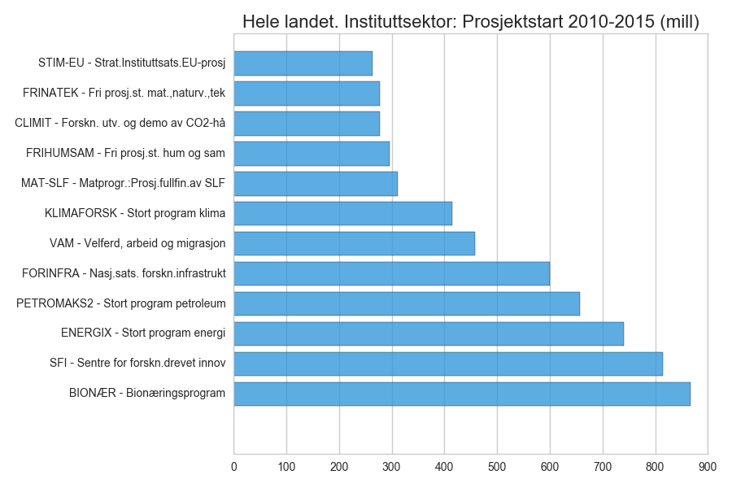
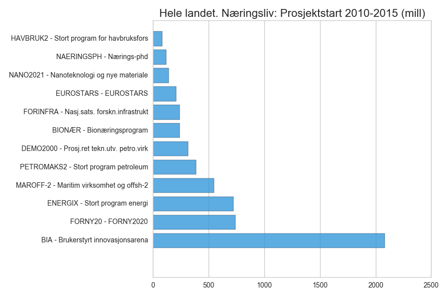
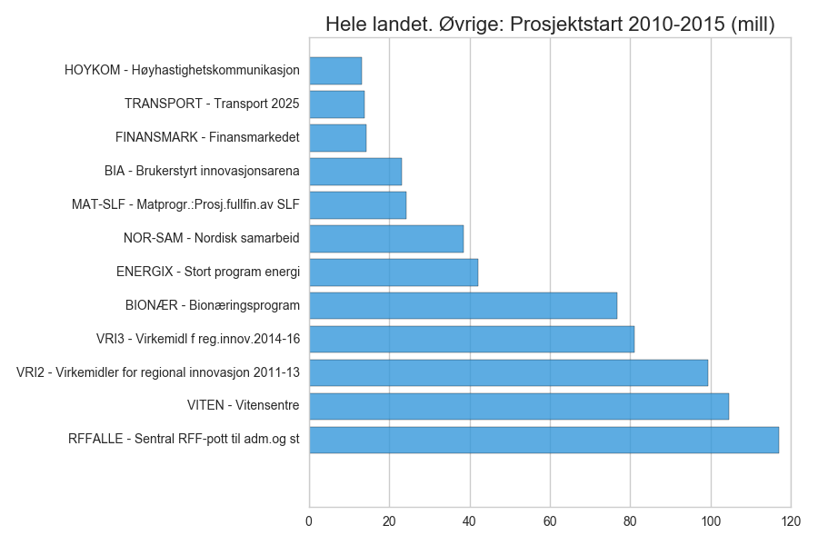

# Hele landet

<a href="https://raw.githubusercontent.com/samspill/regionalt/master/Fylker/Hele landet/BIA Innvilget til aktive prosjekter (mill) (heatmap).png"> (heatmap).png)</a>

<a href="https://raw.githubusercontent.com/samspill/regionalt/master/Fylker/Hele landet/BIA Innvilget til aktive prosjekter (mill) (linjer).png"> (linjer).png)</a>

<a href="https://raw.githubusercontent.com/samspill/regionalt/master/Fylker/Hele landet/BIA regnskapsført beløp for aktive prosjekter (mill) (heatmap).png"> (heatmap).png)</a>

<a href="https://raw.githubusercontent.com/samspill/regionalt/master/Fylker/Hele landet/BIA regnskapsført beløp for aktive prosjekter (mill) (linjer).png"> (linjer).png)</a>

<a href="https://raw.githubusercontent.com/samspill/regionalt/master/Fylker/Hele landet/FORNY sum innvilget til aktive prosjekter (mill) (heatmap).png"> (heatmap).png)</a>

<a href="https://raw.githubusercontent.com/samspill/regionalt/master/Fylker/Hele landet/FORNY sum innvilget til aktive prosjekter (mill) (linjer).png"> (linjer).png)</a>

<a href="https://raw.githubusercontent.com/samspill/regionalt/master/Fylker/Hele landet/FORNY regnskapsført beløp for aktive prosjekter (mill) (heatmap).png"> (heatmap).png)</a>

<a href="https://raw.githubusercontent.com/samspill/regionalt/master/Fylker/Hele landet/FORNY regnskapsført beløp for aktive prosjekter (mill) (linjer).png"> (linjer).png)</a>

<a href="https://raw.githubusercontent.com/samspill/regionalt/master/Fylker/Hele landet/BIA Innvilget til aktive prosjekter - andel av sum hele landet i prosent (heatmap).png">.png)</a>

<a href="https://raw.githubusercontent.com/samspill/regionalt/master/Fylker/Hele landet/BIA Innvilget til aktive prosjekter - Andel i prosent (linjer).png">.png)</a>

<a href="https://raw.githubusercontent.com/samspill/regionalt/master/Fylker/Hele landet/FORNY2020 Innvilget til aktive prosjekter - andel av hele landet i prosent (heatmap).png">.png)</a>

<a href="https://raw.githubusercontent.com/samspill/regionalt/master/Fylker/Hele landet/FORNY2020 Innvilget til aktive prosjekter - andel av hele landet i prosent (linjer).png">.png)</a>

<a href="https://raw.githubusercontent.com/samspill/regionalt/master/Fylker/Hele landet/SkatteFUNN godkjent fradrag (omsøkt) - andel av sum for hele landet (heatmap).png"> - andel av sum for hele landet (heatmap).png)</a>

<a href="https://raw.githubusercontent.com/samspill/regionalt/master/Fylker/Hele landet/SkatteFUNN godkjent fradrag (omsøkt) - andel av sum for hele landet (linjer).png"> - andel av sum for hele landet (linjer).png)</a>

<a href="https://raw.githubusercontent.com/samspill/regionalt/master/Fylker/Hele landet/SkatteFUNN godkjent fradrag (vurdert) - andel av sum for hele landet (heatmap).png"> - andel av sum for hele landet (heatmap).png)</a>

<a href="https://raw.githubusercontent.com/samspill/regionalt/master/Fylker/Hele landet/SkatteFUNN godkjent fradrag (vurdert) - andel av sum for hele landet (linjer).png"> - andel av sum for hele landet (linjer).png)</a>

<a href="https://raw.githubusercontent.com/samspill/regionalt/master/Fylker/Hele landet/BIA Innvilget første halvår til aktive prosjekter (heatmap).png">.png)</a>

<a href="https://raw.githubusercontent.com/samspill/regionalt/master/Fylker/Hele landet/BIA Innvilget første halvår til aktive prosjekter (linjer).png">.png)</a>

